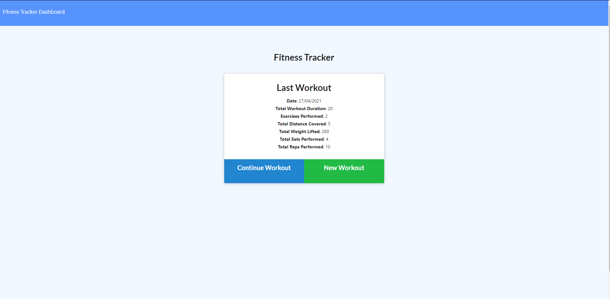

# Fitness Tracker

## Description

The aim of this project was to take a fitness tracker web application for which the front end had already been completed, and add server side code to connect it to a mongodb database and deploy it to a heroku app.

## Table of Contents

- [Installation](#Installation)
- [Usage](#Usage)
- [License](#License)
- [Contributing](#Contributing)
- [Tests](#Tests)
- [Questions](#Questions)

## Screenshot

## Installation

N/A

## Usage

N/A

## License

This project is licensed under [MIT](https://opensource.org/licenses/MIT)

## Contributing

Contribution is welcome.

## Tests

Using the link and adding data via the inputs should suffice.

## Questions

Any further questions can be directed to me via my [GitHub](https://github.com/TopGek99/), or [email](arowe890@gmail.com) if it is a more pressing matter.
